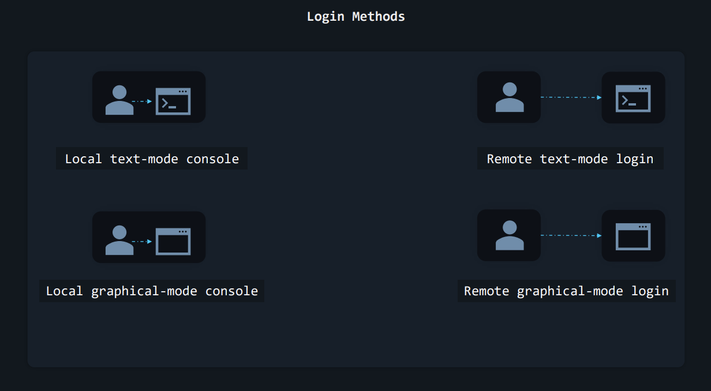
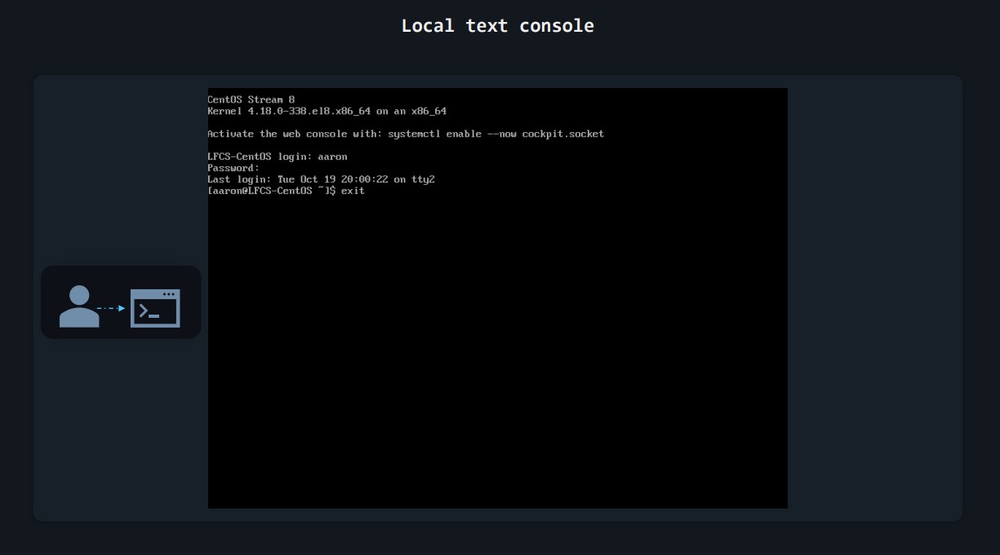
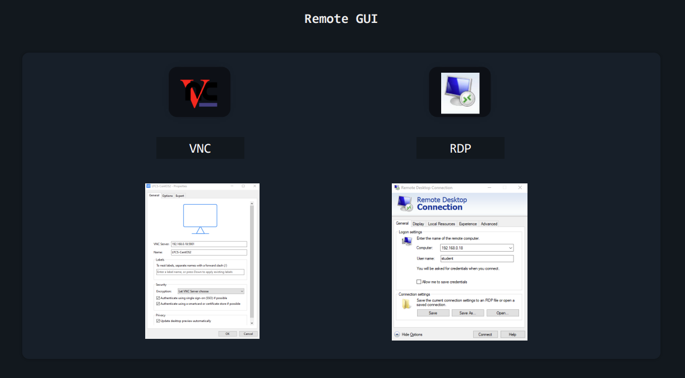

# 0. Course Oeverview
## What is linux operating system?
<p align="justify">
Linux® is an open source operating system (OS). An operating system is the software that directly manages a system's hardware and resources, like CPU, memory, and storage. The OS sits between applications and hardware and makes the connections between all of your software and the physical resources that do the work.
</p>

### What is better Linux or Windows?
<p align="justify">
Windows is generally considered to be easier to use, while Linux is known for its stability and security. In recent years, Linux has been gaining popularity as a desktop operating system, mainly due to the emergence of user-friendly distributions such as Ubuntu and Mint.
</p>

<p align="justify">
The choice between Linux and Windows as an operating system (OS) depends on the user’s needs and preferences. Linux is a popular choice for developers and those who prefer open-source software, as the source code is freely available for modification and distribution.
</p>

### Popular Linux distros
|No|Distros|Type|Command Line|Example|
| :-: | :-: | :-: |:- |:-|
|1|Debian|OS|apt/apt-get install +packege name.|apt install httpd or apt-get install httpd|
|2|Red Hat|OS|yum install +packege name.| yum install httpd |
|3|Ubuntu|OS|apt/apt-get install +packege name.|apt install httpd or apt-get install httpd|
|4|Oracle Linux|OS|yum install +packege name.|yum install httpd|
|5|CenTos|OS|yum install +packege name.|yum install httpd|
|6|Oracle Solaris|OS|yum install +packege name.|yum install httpd|
<p align="center"> TABLE 1 – Popular Linux distros </p>

<b> httpd </b> is the http service or web service that we use to install or hosting web application. Example you use httpd service to hosting wordpress or your own website.

<!--Thi wil descrip all above distros or what is that OS means-->
### Debian
<p align="justify">
<b>Debian</b> is an open source operating system. This distribution was first announced by Ian Murdock in 1993 as the “Debian Linux Release”. The Debian Project is a community of developers and users that maintain the GNU OS based on open source software. Currently, Debian systems use the Linux kernel or the FreeBSD kernel. However, they are also working on providing Debian for other kernels. Primarily, GNU Hurd.

<b>Debian License</b>: BSD, GPL and other open licenses.

<b>Debian Latest major release</b>: Debian 12 (Bookworm).
</p>

### Red Hat Enterprise
<p align="justify">
<b>Red Hat Enterprise Linux (RHEL)</b> is a commercial Linux distribution developed by Red Hat. It has a server version and a desktop version. As it uses open source software, published under a General Public License, they make their code available to the public via CentOS. Red Hat has sponsored the CentOS project since 2014.

<b>RHEL License</b>: GPL.

<b>RHEL Latest major release</b>: RHEL 9.
</p>

### Ubuntu
<p align="justify">
<b>Ubuntu</b> is a Linux distribution based on Debian. It is developed by Canonical and a community of developers. It has 3 official editions: Desktop, Server and Core, which can either run on a computer or on a VM. More than 34% of the websites using Linux use Ubuntu, according to W3Techs data. Its growth since 2010 has been amazing. It is also a popular distribution among cloud computing projects.

<b>Ubuntu License</b>: GPL and other licenses.

<b>Ubuntu Latest major release with long-term support (LTS)</b>: Ubuntu 22.04 LTS (Jammy Jellyfish).
</p>

### Oracle Linux
<p align="justify">
<b>Oracle Linux (OL)</b> is a Linux distribution packaged and distributed by Oracle; under GNU GPL since late 2006. It was formerly known as Oracle Enterprise Linux (OEL). It is based on RHEL’s source code. Oracle Linux is available with two Linux kernels: the Red Hat Compatible Kernel (RHCK) and the Unbreakable Enterprise Kernel (UEK).

<b>Oracle Linux License</b>: GNU GPL and other licenses.

<b>Oracle Linux Latest major release</b>: Oracle Linux 9.
</p>

### CentOS
<p align="justify">
<b>CentOS Linux</b> is a distribution based on the source code of the commercial distribution Red Hat Enterprise Linux (RHEL). It was launched in 2004 and is backed up by a growing community. It is a safe bet for those looking for high-quality code. But CentOS 8 will be its last version. In 2019, Red Hat announced that CentOS Linux would be replaced by CentOS Stream — an upstream development platform for RHEL. New open source alternatives have appeared due to this change of strategy. For instance, Rocky Linux, founded by Gregory Kurtzer, founder of the CentOS project.

<b>CentOS Linux License</b>: GNU GPL.

<b>CentOS Linux Latest major release</b>: CentOS Linux 8.
</p>

### Oracle Solaris
<p align="justify">
<b>Solaris</b> is a proprietary Unix operating system originally developed by Sun Microsystems. After the Sun acquisition by Oracle in 2010, it was renamed Oracle Solaris.
</p>
<p align="justify">
<b>Solaris</b> superseded the company's earlier SunOS in 1993, and became known for its scalability, especially on SPARC systems, and for originating many innovative features such as DTrace, ZFS and Time Slider.[4][5] Solaris supports SPARC and x86-64 workstations and servers from Oracle and other vendors. Solaris was registered as compliant with the Single UNIX Specification until 29 April 2019.
</p>


##  Leaning Recourses
|No|OS|URL|
| :-: | :-: | :- |
|1|CentOS Stream 8|https://centos.org/centos-stream|
|2|Ubuntu Server 22.04.3 LTS|https://ubuntu.com/download/server|

<!--This is will show off relate to the Linux login methods-->
## Login Methods

1. Local text-mode console
2. Remote text-mode login
3. Local graphical-mode console
4. Remote graphical-mode login


<p align="center"> FIGURE 2 – Login Methods </p>

Nowadays, consoles and terminals, in Linux, are usually things that exist in software, rather than hardware. For example:

•  When you see Linux boot and a bunch of text appears on screen, telling you what happens as the operating system is loading – that’s the **console**.

•  After a Linux machine has booted, if you press **CTRL+ALT+F2** on the keyboard, you’ll see a **virtual terminal (vt2)**.

•  If you have Linux installed on your desktop, with a graphical user interface, when you want to type commands you open up a **terminal emulator**


<p align="center"> FIGURE 3 – Login Methods </p>
Let’s move back to logins. In practice, most often you’ll log in to remote Linux systems. But let’s start with the less common scenarios.

### Logging into Local Linux Systems
“Local” is just a tech word for “something that is in front of you” or “something you can physically access”. A computer on your desk is local. A server running on Google Cloud is **remote**.
#### Local GUI
<p align="justify">
Usually, when Linux is installed on servers, it is installed without GUI (Graphical User Interface) components. There’s no mouse pointer, no buttons, no windows, no menus, nothing of that sort, just text. But you might sometimes run across servers that include this GUI. Logging in is super easy, as it’s all “in your face”. You’ll see a list of users you can choose from and you can then type your user’s password. </p> Don’t forget to log out when you’ve finished your work.

#### Local Text Console (or Virtual Terminal)
If the device has the typical server-oriented Linux OS installed, without any GUI components, logging in (locally) is also easy. You’ll usually see something like this on your screen: 


<p align="center"> FIGURE 4 – Local Text Console </p>

<p align="justify">
There’s no list of users this time, but you can just type your username and then your password. Note that as you type the password no text is displayed. If you’ve already done this a few times in the past, it will be no surprise. But for someone doing it for the first time, it might be misleading, giving the impression that the password is not accepted, or received, or something along those lines. It’s no issue. And if you type something wrong, you can actually press backspace to delete the last character you mistyped. Or you can press backspace multiple times to delete the whole password and type it again. </p>
When your work is done, you should type <b>exit</b> to log out.

```bash
exit
```
#### Logging into Remote Linux Systems
Most of your logins will be to remote systems as fewer and fewer companies keep servers on-site these days, preferring to use the cloud.
#### Remote GUI
<p align="justify">Again, most Linux operating systems running on servers will have no GUI components installed. But you will sometimes run into exceptions. Connecting to a remote server, to its graphical user interface is slightly more tricky. First of all, there is no standard set in stone. Whoever configured that server chose their preferred way of dealing with these remote graphical logins. They could have chosen to install a VNC (Virtual Network Computing) solution. In this case, you’d need to download the proper VNC client (also called “VNC viewer”) to connect to it. This might be TightVNC or RealVNC or something else entirely. It all depends on the VNC server running on the remote system and what VNC clients your local operating system supports.</p>

<p align="justify">If the administrator of that server wanted to let Windows users connect easily, it might mean that they used a solution allowing for RDP connections (Remote Desktop Protocol). This means you can just click on the Windows start button, type “Remote Desktop Connection”, open that app, and then enter the username and password you’ve been provided.</p>

<p align="justify">Whatever it might be, connecting to a remote graphical console is pretty easy. It all boils down to downloading the application that lets you do that, entering the remote system’s IP address, followed by a username and a password. </p>


<p align="center"> FIGURE 5 – Remote GUI </p>

#### Remot SSH/Telnet
Both **SSH** or **Telnet** are can use to remote connect to your target machines for your task or activities. However, the **Telnet** connect is non-secure session or not encrypted session that the attacker will able to attamp to hack.


<p align="center"> FIGURE 6 – Remot SSH/Telnet </p>

### Logging into Remote Systems with SSH (text-mode logins)
<p align="justify">Initiating a text-based remote connection to a Linux system is pretty standard. That’s because almost every Linux server uses the same tool that allows for remote logins: the OpenSSH daemon (a program that runs in the background, on the server, all the time). SSH comes from Secure SHell. Until SSH, something called telnet was the standard. telnet was highly insecure as it did not encrypt communication between you and the server you were connecting to. This meant that anyone on the same network with you could steal your Linux user password and see everything you did on that server, during your telnet session. The SSH protocol uses strong encryption to avoid this and the OpenSSH daemon is built carefully to avoid security bugs as much as possible. Long story short, OpenSSH is used by millions of servers and has stood the test of time, proving to be very hard to hack. For these reasons everyone happily uses it and trusts that it can do a pretty good job at only letting authorized people log into their operating systems while keeping bad people out.

In case you’re following along on your virtual machine, log in locally (directly from the virtual machine window) and then enter this command: </p>


```bash
ip a
```
You’ll see what IP your machine uses.


<p align="center"> FIGURE 7 - SSH Login </p>
<p align="justify">We’ll use this IP, 192.168.0.17 to simulate a situation where we have a server in a remote location.</p>

<p align="justify">Now to recap. We have an SSH daemon (program) running on the server. This listens for any incoming connections. To be able to connect to this remote SSH daemon, we’ll need something called an SSH client (yet another program). This client will run on our current laptop/desktop computer.</p>

<p align="justify">MacOS systems and Linux-based operating systems, such as Ubuntu, already have an SSH client preinstalled. If your computer/laptop had Windows on it, however, in the past, you needed to install an SSH client like PuTTY. On the latest Windows 10 this is no longer necessary as an SSH client is also preinstalled. If you’re on MacOS or Linux, open a terminal emulator window. If you’re on Windows, click the Start Menu and type “cmd” to open up Command Prompt.</p>
<p align="justify">
To connect to a remote Linux system through SSH, type: </p>

```bash
ssh alex@10.11.12.9
```
Of course, replace “alex” with the actual username you created inside your Linux OS running in the virtual machine. Same with the IP number.


<p align="center"> FIGURE 8 - Mac & Linux Login </p>


#### Enjoy to your learning!