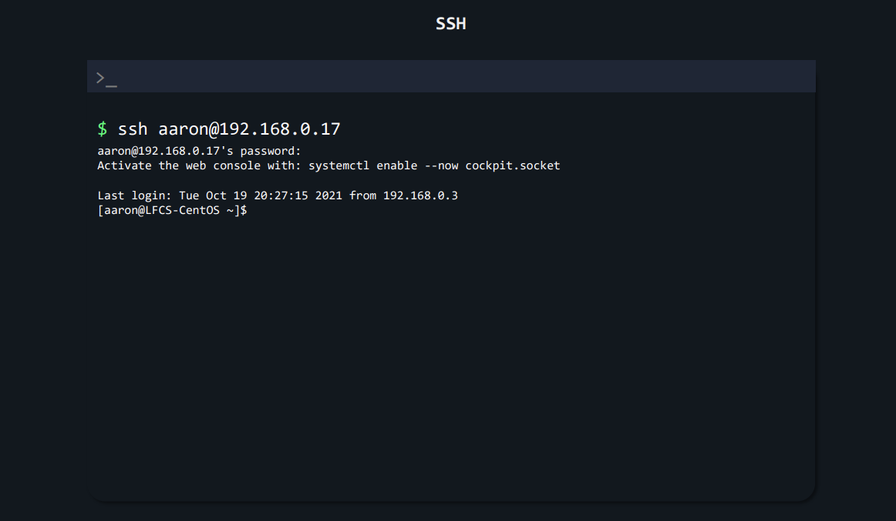
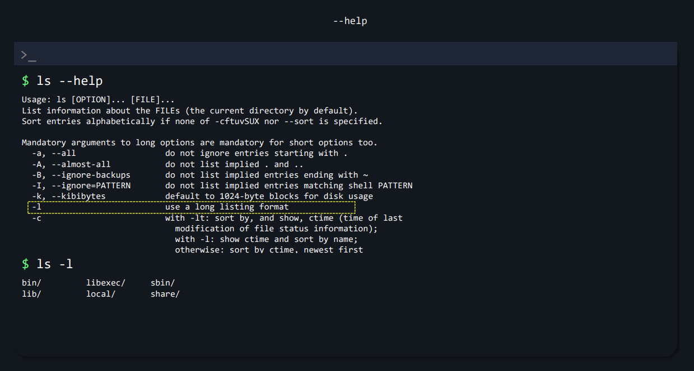

# 1. Essential Commands
First you have to be ready for your own labs call Linux testing environment server and connect using **SSH** protocol via example bolow:

```
ssh aaron@192.168.0.1
```

<p align="center"> FIGURE 9 - SSH to target server </p>

#### ls command
- **ls** is used to list files or directories in Linux and other Unix-based operating systems.
- <p align="justify">**--help** is the simplest way to get information regarding a built-in shell command. It helps you fetch information from the shell's.</p>
- <p align="justify">**-l** use a long listing formart that will contain all information such as permission of directory, date creation, and els.</p>


<p align="center"> FIGURE 10 - ls -l command </p>