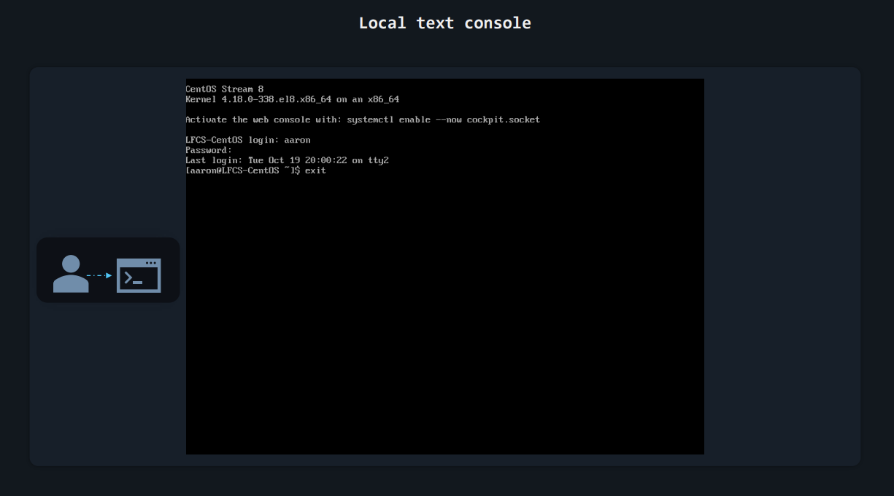
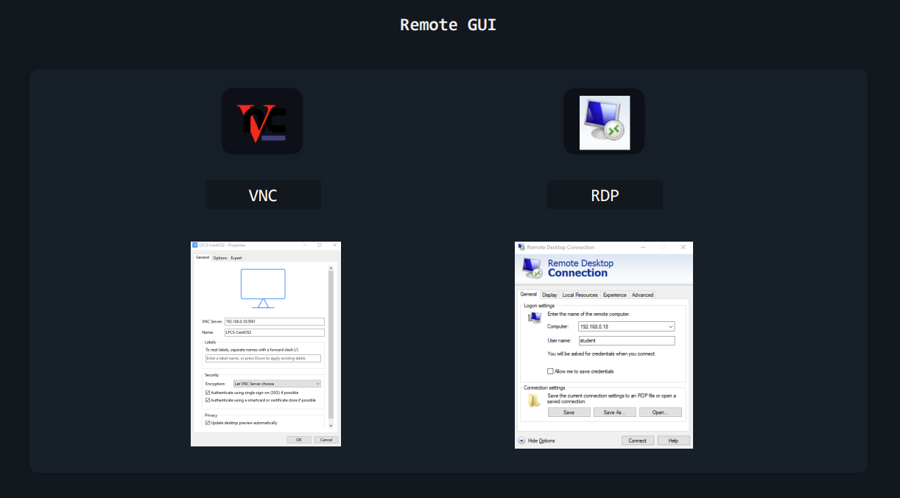

# 1. Essential Commands
## 1.1 Leaning Recourses
|No|OS|URL|
| :-: | :-: | :- |
|1|CentOS Stream 8|https://centos.org/centos-stream|
|2|Ubuntu Server 22.04.3 LTS|https://ubuntu.com/download/server|

<!--This will show off relate to the Linux login methods-->
## Login Methods

1. Local text-mode console
2. Remote text-mode login
3. Local graphical-mode console
4. Remote graphical-mode login


<p align="center"> FIGURE 2 – Login Methods </p>

Nowadays, consoles and terminals, in Linux, are usually things that exist in software, rather than hardware. For example:

•  When you see Linux boot and a bunch of text appears on screen, telling you what happens as the operating system is loading – that’s the **console**.

•  After a Linux machine has booted, if you press **CTRL+ALT+F2** on the keyboard, you’ll see a **virtual terminal (vt2)**.

•  If you have Linux installed on your desktop, with a graphical user interface, when you want to type commands you open up a **terminal emulator**


<p align="center"> FIGURE 3 – Login Methods </p>
Let’s move back to logins. In practice, most often you’ll log in to remote Linux systems. But let’s start with the less common scenarios.

### Logging into Local Linux Systems
“Local” is just a tech word for “something that is in front of you” or “something you can physically access”. A computer on your desk is local. A server running on Google Cloud is **remote**.
#### Local GUI
<p align="justify">
Usually, when Linux is installed on servers, it is installed without GUI (Graphical User Interface) components. There’s no mouse pointer, no buttons, no windows, no menus, nothing of that sort, just text. But you might sometimes run across servers that include this GUI. Logging in is super easy, as it’s all “in your face”. You’ll see a list of users you can choose from and you can then type your user’s password. </p> Don’t forget to log out when you’ve finished your work.

#### Local Text Console (or Virtual Terminal)
If the device has the typical server-oriented Linux OS installed, without any GUI components, logging in (locally) is also easy. You’ll usually see something like this on your screen: 


<p align="center"> FIGURE 4 – Local Text Console </p>

<p align="justify">
There’s no list of users this time, but you can just type your username and then your password. Note that as you type the password no text is displayed. If you’ve already done this a few times in the past, it will be no surprise. But for someone doing it for the first time, it might be misleading, giving the impression that the password is not accepted, or received, or something along those lines. It’s no issue. And if you type something wrong, you can actually press backspace to delete the last character you mistyped. Or you can press backspace multiple times to delete the whole password and type it again. </p>
When your work is done, you should type <b>exit</b> to log out.

```bash
exit
```
#### Logging into Remote Linux Systems
Most of your logins will be to remote systems as fewer and fewer companies keep servers on-site these days, preferring to use the cloud.
#### Remote GUI
<p align="justify">Again, most Linux operating systems running on servers will have no GUI components installed. But you will sometimes run into exceptions. Connecting to a remote server, to its graphical user interface is slightly more tricky. First of all, there is no standard set in stone. Whoever configured that server chose their preferred way of dealing with these remote graphical logins. They could have chosen to install a VNC (Virtual Network Computing) solution. In this case, you’d need to download the proper VNC client (also called “VNC viewer”) to connect to it. This might be TightVNC or RealVNC or something else entirely. It all depends on the VNC server running on the remote system and what VNC clients your local operating system supports.</p>

<p align="justify">If the administrator of that server wanted to let Windows users connect easily, it might mean that they used a solution allowing for RDP connections (Remote Desktop Protocol). This means you can just click on the Windows start button, type “Remote Desktop Connection”, open that app, and then enter the username and password you’ve been provided.</p>

<p align="justify">Whatever it might be, connecting to a remote graphical console is pretty easy. It all boils down to downloading the application that lets you do that, entering the remote system’s IP address, followed by a username and a password. </p>


<p align="center"> FIGURE 5 – Remote GUI </p>
