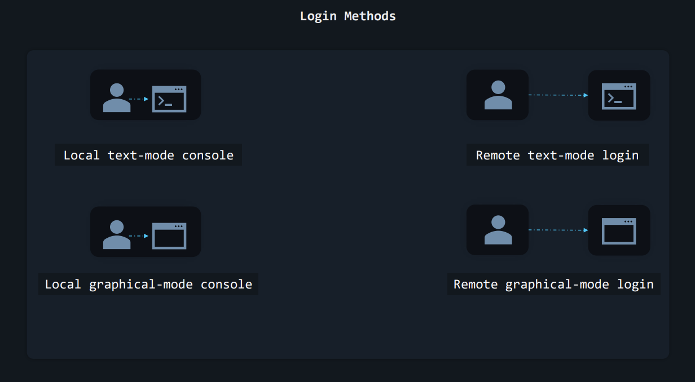
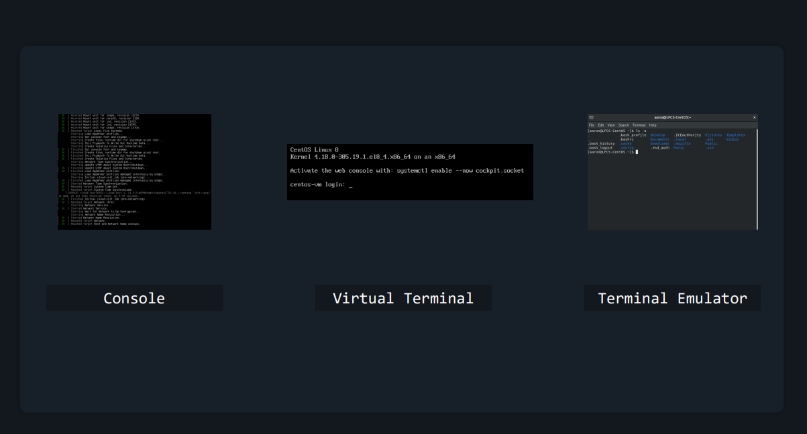

# 1. Essential Commands
## 1.1 Leaning Recourses
|No|OS|URL|
| :-: | :-: | :- |
|1|CentOS Stream 8|https://centos.org/centos-stream|
|2|Ubuntu Server 22.04.3 LTS|https://ubuntu.com/download/server|

<!--This is will show off relate to the Linux login methods-->
## Login Methods
<!--This is will link to Youtube vidoe-->
<iframe width="420" height="315"
src="https://youtu.be/t3e_CaC4V_k">
</iframe>

1. Local text-mode console
2. Remote text-mode login
3. Local graphical-mode console
4. Remote graphical-mode login

 FIGURE 2 – Login Methods 

Nowadays, consoles and terminals, in Linux, are usually things that exist in software, rather than hardware. For example:
- When you see Linux boot and a bunch of text appears on screen, telling you what happens as the operating system is loading – that’s the <b>console</b>.
- After a Linux machine has booted, if you press <b>CTRL+ALT+F2</b> on the keyboard, you’ll see a <b>virtual terminal (vt2)</b>.
- If you have Linux installed on your desktop, with a graphical user interface, when you want to type commands you open up a <b>terminal emulator</b>.

 FIGURE 3 – Login Methods 

